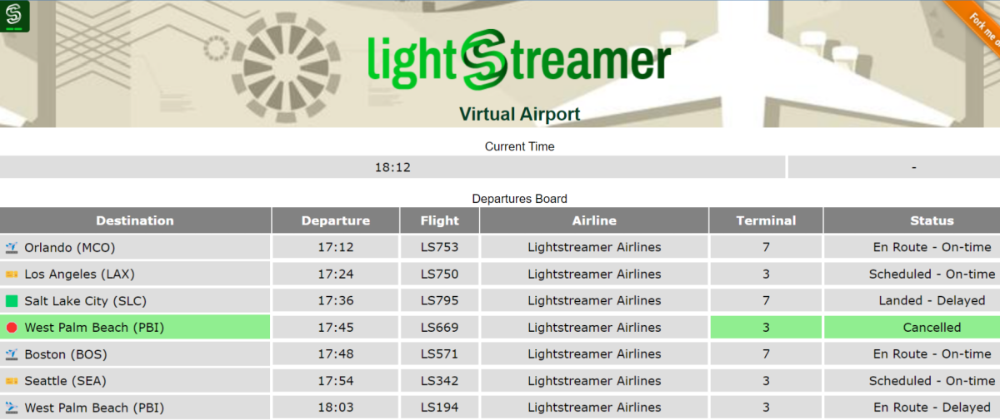

# Lightstreamer - Airport Demo - Web Client

This project includes a Lightstreamer web client that subscribes to and show data from the [Lightstreamer - Kafka Demo - Java Adapter](https://github.com/Lightstreamer/Lightstreamer-example-Kafka-adapter-java).

## Live Demo

<br>
### [ View live demo]( ... )

## Details

The demo emulates a fundamental departures board consisting of ten rows, each representing flight departure information from a hypothetical airport.
The simulated data, inputted into a [Kafka cluster](https://kafka.apache.org/), is fetched and injected into the Lightstreamer server via the [Lightstreamer Kafka Connector](https://github.com/Lightstreamer/Lightstreamer-kafka-connector), as elaborated further in the adapter project documentation.

This page uses the [Web Client SDK API for Lightstreamer](https://lightstreamer.com/api/ls-web-client/latest/) to handle the communications with Lightstreamer Server. A simple user interface is implemented to display the real-time data received from Lightstreamer Server.

The demo basically execute a single [Subscription](https://lightstreamer.com/api/ls-web-client/latest/Subscription.html) with ten items subscribed to in **MERGE** mode feeding a [DynaGrid](https://lightstreamer.com/api/ls-web-client/latest/DynaGrid.html) with the current list and status of the next departing flights (according with the simulated time).
The list of the ten Items to subscribe to is as follows:
```javascript
itemsList = ["flights-[key=10]", "flights-[key=1]", "flights-[key=2]", "flights-[key=3]", "flights-[key=4]", "flights-[key=5]", "flights-[key=6]", "flights-[key=7]", "flights-[key=8]", "flights-[key=9]" ];
```
each representing a row on the board. The table is then kept sorted by departure time by setting the [setSort](https://sdk.lightstreamer.com/ls-web-client/9.2.0/api/DynaGrid.html#setSort) call of the DynaGrid object.

## Install

If you want to install a version of this demo pointing to your local Lightstreamer Server, follow these steps:

* As prerequisite, the [Lightstreamer - Kafka Demo - Java Adapter](https://github.com/Lightstreamer/Lightstreamer-example-Kafka-adapter-java) has to be deployed on your local Lightstreamer Server instance. Please check out that project and follow the installation instructions provided in it.
* Download this project.
* Deploy this demo on the Lightstreamer Server (used as Web server) or in any external Web Server. If you choose the former, create the folders `<LS_HOME>/pages/demos/airport70` (you can customize the last two digits based on your favorite movie in the series) and copy here the contents of the `src` folder of this project.

*The client demo configuration assumes that Lightstreamer Server, Kafka Cluster, and this client are launched on the same machine. If you need to target a different Lightstreamer server, please double check the `LS_HOST` variable in `src/js/const.js` and change it accordingly.*

* Open your browser and point it to: [http://localhost:8080/DynamoDBDemo](http://localhost:8080/airport70)

## See Also

* [Lightstreamer - Kafka Demo - Java Adapter](https://github.com/Lightstreamer/Lightstreamer-example-Kafka-adapter-java)
* [Lightstreamer Kafka Connector](https://github.com/Lightstreamer/Lightstreamer-kafka-connector)

## Lightstreamer Compatibility Notes

- Compatible with Lightstreamer JavaScript Client library version 7.4 or newer.
